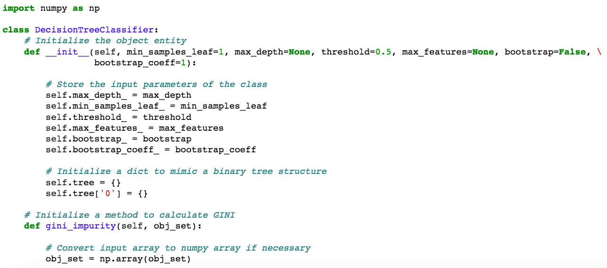

# bdrgnlearn

### Classic machine learning algorithms implemented in plain Python / Numpy. 

# Contents

### 0) [Sequential Neural Networks.](bdrgnlearn/neural.py) 
### 1) [Random Forests.](bdrgnlearn/ensemble.py) 
### 2) [Decision Trees.](bdrgnlearn/tree.py)
### 3) [Linear models: LinearRegression and LogisticRegression.](bdrgnlearn/linear_model.py)
### 4) [KMeans clustering.](bdrgnlearn/cluster.py)
### 5) [KNN or K-nearest Neighbors.](bdrgnlearn/neighbors.py)
### 6) [Confusion Matrix, Precision, Recall.](bdrgnlearn/metrics.py)

# Principles

* In this project I value readability over performance. 

* Each algorithm implementation is an interactive lecture note. 

* Here is a [demo](https://nbviewer.jupyter.org/github/bdrgn/bdrgnlearn/blob/master/DEMO.ipynb) showing algorithms at work.

* It works like this basically.

